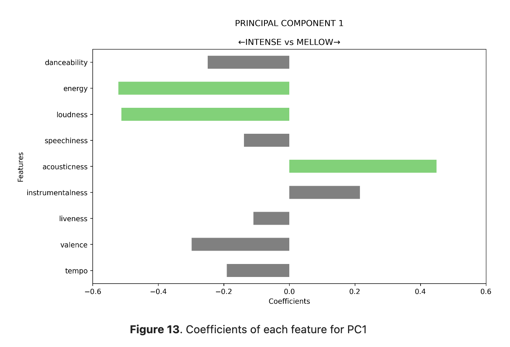
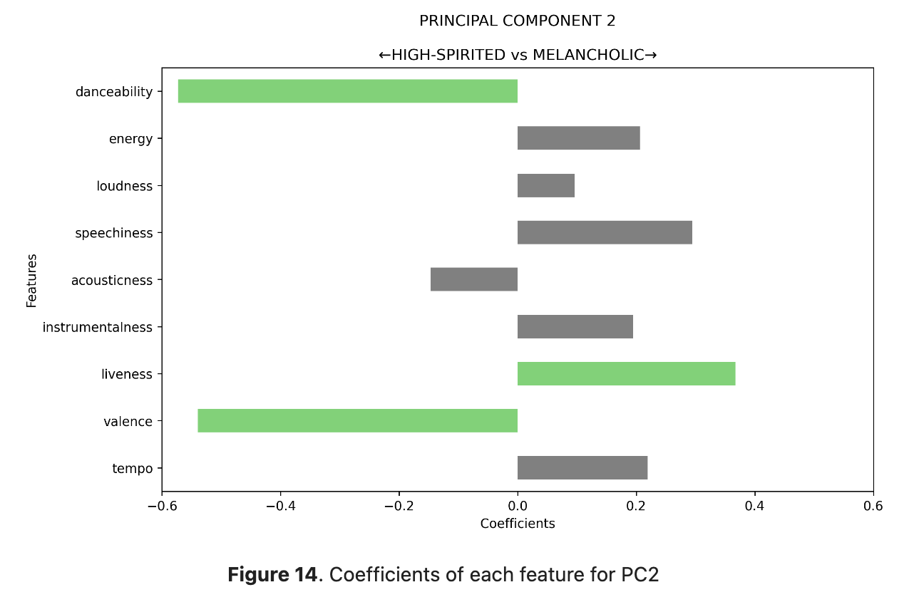
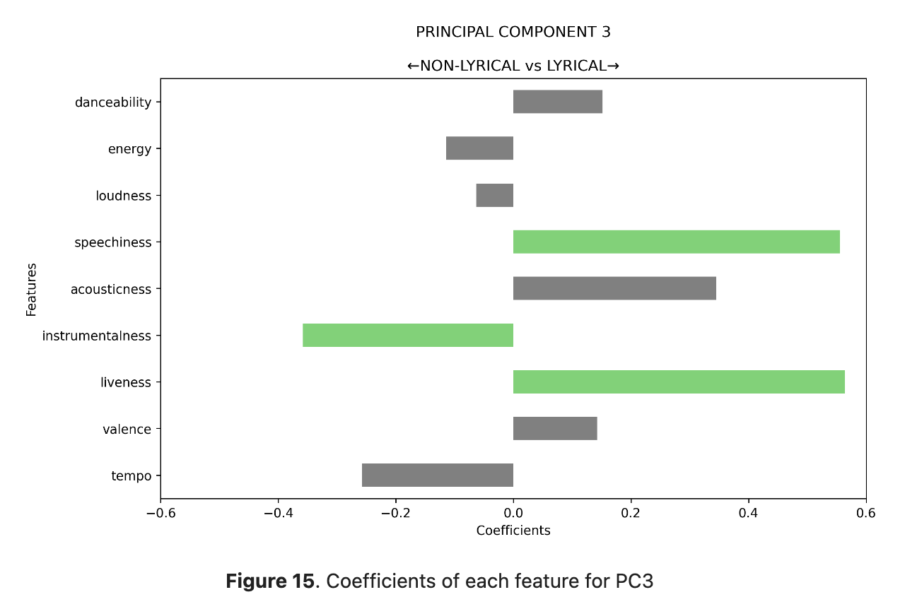

<h1></h1>

<h1>Authors</h1>
Paula Martinez, Anish Pati, Richard Rian, Jeremiah Soliman, James Zabala

<h1>Project Description</h1>
In the realm of music recommendation, current methods typically study the listening activity of a user to generate song suggestions. However, these approaches lack a nuanced understanding of the music style that the user prefers. Our objective is to delve into these nuances and innovate music recommendations by introducing a more intricate understanding of individual musical preferences. This project culminates in the creation of distinctive musical archetypes for Spotify users, which could serve as the foundation for the generation of personalized song playlists based on these archetypes.

<h1>Interpretation of Principal Components</h1>

This project performed Principal Component Analysis (PCA) on various audio features of songs to identify the main components that characterize different aspects of the music.

    

        
        
Figure 13 (PC 1) shows that this principal component captures the intensity or mellowness of songs, with high positive coefficients for features like energy, loudness, and acousticness. This component allows classifying songs based on their overall intensity or mellowness.

    

    

        
        
Figure 14 (PC 2) represents whether a song seems high-spirited or melancholic, with positive coefficients for features like danceability, liveness, and valence. Negative coefficients are associated with energy, loudness, and other features linked to a more melancholic mood.

    

    

        
        
Figure 15 (PC 3) distinguishes between non-lyrical (instrumental) and lyrical songs. Positive coefficients for speechiness, liveness, and instrumentalness indicate non-lyrical or instrumental tracks, while negative coefficients for these features suggest lyrical songs with more vocal content.

    

<h1>Musical Archetypes</h1>

